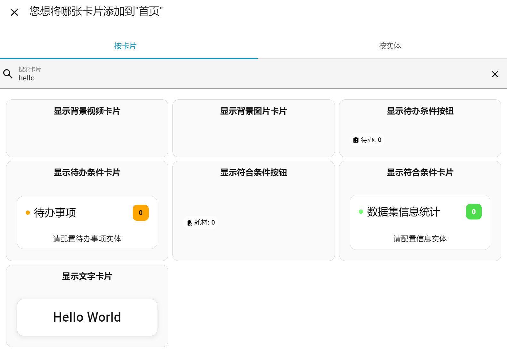

# hello-card

## Home Assistant 多功能合集卡片

**HACS安装方法**

💡
如果是使用HACS安装，请选择右上角的三个点后，点选“自定义仓库”，

仓库地址为： https://github.com/ycxlb/hello-card

类型为：仪表盘（Dashboard）

添加完成后，在 HACS 里搜索和显示的名称就是 Hello Card，

然后下载安装并重启HA.

进入仪表盘，点击“编辑仪表盘”，然后点击“添加卡片”，直接搜索“hello”卡片，即可看到对应卡片，

选择卡片后就可进行可视化编辑。

YAML的资源调用方法
~~~
mode: yaml
resources:
  - url: /hacsfiles/hello-card/hello-card.js
    type: module
~~~  
**添加卡片时注意**
<pre>
    以下操作一般都需要添加监控的实体数据，根据列出的实体数据显示符合条件的对应信息，
默认监控的是实体的默认数据，也可以通过修改属性名称，监控对应属性的数据，
比如实时监控RGB灯的亮度，亮度就是另外的非默认属性，而灯的默认数据是打开或者关闭。
</pre>
文件列表如下：

- `hello-world-card.js`： 在按钮上显示配置的文字

🚀 调用方法：
~~~
type: custom:hello-world-card
name: 计算机科学
~~~
- `hello-image-card.js`： 多张图片随机背景，图片URL列表中每张图片地址输完回车

🚀 调用方法：
~~~
type: custom:hello-image-card
top: 0vh
url:
  - https://www.xxx.com/pic/1.jpg
  - https://www.xxx.com/pic/2.jpg
  - https://www.xxx.com/pic/3.jpg
~~~
- `hello-video-card.js`： 多个视频随机背景，视频URL列表中每个视频地址输完回车

🚀 调用方法：
~~~
type: custom:hello-video-card
top: 0vh
url:
  - https://www.xxx.com/mp4/1.mp4
  - https://www.xxx.com/mp4/2.mp4
  - https://www.xxx.com/mp4/3.mp4
~~~
- `hello-infodata-button.js`： <pre>根据实体属性按照设定好的换算条件计算后的数据再根据设定的过滤条件统计出符合条件的数据  
                               个数并在界面显示按钮，点击按钮弹出详细信息，支持跨实体、多级公式和括号运行</pre>

🚀 调用方法：
~~~
type: custom:hello-infodata-button
name: 数据集信息统计
entities:
  - entity_id: light.office_rgbw_lights
    overrides:
      icon: mdi:wifi
      name: RGB灯
      conversion: k/2.55+1-1*1
      unit_of_measurement: "%"
    attribute: brightness
    rules:
      - expression: >-
          (switch.ban_gong_shi_dian_nao_socket=='on') and ((brightness < 10) or
          (brightness > 90))
  - entity_id: switch.ban_gong_shi_dian_nao_socket
badge_mode: false
auto_hide: false
button_text: 亮灯
hide_zero: false
transparent_bg: false
lock_white_fg: false
hide_icon: false
hide_colon: false
button_width: 165px
button_height: 30px
yes_preview: true
columns: "1"
theme: "on"
~~~
- `hello-infodata-card.js`： 在界面上显示符合条件的数据

🚀 调用方法：
~~~
type: custom:hello-infodata-card
name: 异常检测
entities:
  - entity_id: light.office_rgbw_lights
    attribute: brightness
    rules:
      - expression: >-
          (switch.ban_gong_shi_dian_nao_socket == 'on') and ((brightness < 10)
          OR (brightness > 90))
    overrides:
      conversion: k/2.55+1-1*1
      name: RGB灯亮度
      unit_of_measurement: "%"
  - entity_id: input_number.phone_balance
  - entity_id: input_number.water_balance
  - entity_id: switch.ban_gong_shi_dian_nao_socket
columns: "1"
theme: "off"
~~~
- `hello-todo-button.js`： 在界面上集成显示待办事项（未办理）的个数按钮，点击按钮弹出待办详细信息

🚀 调用方法：
~~~
type: custom:hello-todo-button
badge_mode: false
auto_hide: false
hide_colon: false
no_preview: true
entities:
  - todo.shopping_list
  - todo.daily_tasks
  - todo.work_tasks
~~~
- `hello-todo-card.js`： 在界面上直接显示HA中的待办事项

🚀 调用方法：
~~~
type: custom:hello-todo-card
theme: "off"
entities:
  - todo.daily_tasks
  - todo.work_tasks
  - todo.shopping_list
~~~
